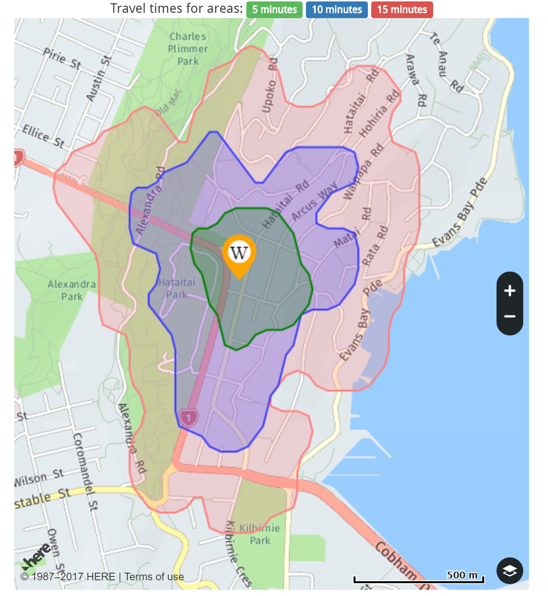

  
  <h2 align="center">Where's Welly</h2>
  

    Awesome travel time visualisation of Wellington, courtesy of Govhack 2017.
     
    <a href="https://drive.google.com/drive/u/2/folders/0B3SjqsAKahBWd2hpeVdxYUNIUTQ">Check out our Google Drive</a>
    &middot;
    <a href="https://youtube.com">Watch Our Youtube Video</a>
    &middot;
    <a href="https://govhack.org.nz/wellington/">Vote for us on Govhack 2017</a>
  

 

## Table of contents

- [Introduction](#introduction)
- [Demonstration](#demonstration)
- [For Developers](#for-developers)

## Introduction
Wellington is a complicated city. Threaded with narrow, winding roads and tunnels looping through hilly terrain, it can be difficult for new-comers (and old timers!) to wrap their heads around the cities, suburbs and the connections inbetween.

Where's Wally is a tool to help current and prospective Wellingtonians plan where to live and explore in the windy city. If you are planning on moving in and want somewhere close to work, you can use Where's Wally to help you find where is best for you.

## Demonstration

At [Where's Welly](http://mapsnz.link/index.php?id=19), users can mark their work and home locations, and gain useful statistics about travel times by vehicle, by foot as well as recent rent statistics, courtesy of MBIE. Regions are mapped to indicate 5, 10 and 15 minute travel time from the work location.

### Looking for Home
Users with a fixed work location who are looking for where to live can set their markers like this. Khandallah (marked "H" on the map) might look close on the map, but in terms of travel time you would be better of further away.

[Where's Welly](http://mapsnz.link/index.php?id=19) also calculates the following:
- Travel time by foot, bicycle or vehicle
- Basic accomodation, fuel and parking costs for getting to and from your work location

It is also possible to plot regions based on walking distance. If you simply want to take a walk and see how far is too far, Where's Wally will help you do that too.

### Looking for Work
For users with a fixed home or school location who are looking for work in Wellington can set their markers like this. This way, the tool will tell you which parts of Wellington are most accessible (and cheap!) from where you live.

### Cost Example

We love Wellington [photo of hat]  but it’s weird.[Wellington is Weird board on video]

  [Gerrymander picture - stokes valley carrot]

Due to its hills, layout, and public transport quirks things can be further away or closer than they seem. [images of Wellington, still face of Mckayla Maroney face]

Using the APIs from HERE  [HERE HOME PAGES]

and several open data sets from MBIE, [Screen cap] Stats.NZ and Data.govt.nz [Screen cap Data.govt.nz]  

 we’ve created a tool that lets you pick a spot on the map and see everywhere you can get to within 5, 10, or 15 minutes.  [image, see it in work]

You can filter by mode of transport, [show the thing]

 time of day, [show the thing]

day of the week. [show the thing]

We also provide a layer of resources which you can switch on/off to see what destinations you can reach.

[Rachel- house buyer] I’ve [been trying to buy a house in Wellington and] spent hours on google maps searching travel times for properties, and even longer driving to Open Homes.  

[Which is closer:Tawa or Johnsonville? [picture standing at the station looking up] 
Ohiro Bay or Kilbirnie [picture] ? 
Wainuiomata or Eastbourne?]  
Where the well do you want to live?  [image #dadjoke]
The answers may surprise you.  

Current sites don’t let you search by commuting times 

Some places that look good on a map actually suck to commute from [show images]. 

 And other places [Tawa] are underrated - and with house prices increasing fast, learning this too late is expensive [sad face Rachel looking at auction costs]. 

[Renter] I’ve made the mistake of renting where I thought was close to town: only to find that buses didn’t run in the weekend [look at bus stop] - no after work movies or dance classes for me.  

Our tool also can help with:
Visitors to Wellington booking their accommodation [ask backpacker to use outside station
Renters new to town who don’t have a car
Retirees wanting to live where they don’t have to drive [
Planning exercise routes [someone dressed for jogging]
And in law enforcement [cops and robbers?]

Future development goals include:
Better capturing public transport options 
Adding more layers of services
Building on the happiness and self-assessed health scores from the Human Health Survey 
Adjusting the scale to match commuting preferences
Integrating with existing rental and house sales websites so that their information is more useful. 

